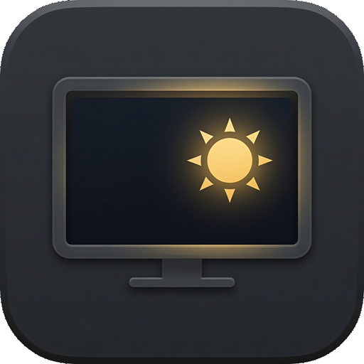
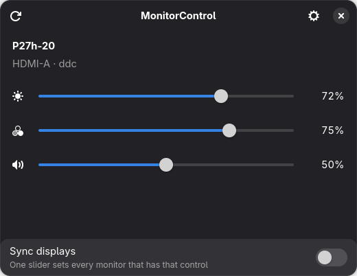
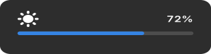

<div align="center">



</div>

# MonitorControl for Linux

[](https://github.com/jaimehisao/monitorcontrol/actions/workflows/ci.yml)
[](https://github.com/jaimehisao/monitorcontrol/releases)

Control brightness, contrast, and volume on **whatever is plugged in** —
the way [MonitorControl](https://github.com/MonitorControl/MonitorControl)
does on macOS: keys, an on-screen HUD, and a slider where the desktop
already puts brightness.

<div align="center">





</div>

## Downloads

RPM and Debian packages are the primary installation formats. They use the
distribution's GTK 4, libadwaita, and PyGObject packages. See the Fedora and
Ubuntu packaging notes below.

Python wheels and source distributions are secondary artifacts attached to
[GitHub Releases](https://github.com/jaimehisao/monitorcontrol/releases).
They still require GTK 4, libadwaita, and PyGObject from the distribution:

```bash
pip install monitorcontrol-*-py3-none-any.whl
```

## Fedora (dnf), Ubuntu, and Debian (apt)

The license is **MIT**: anyone can use, copy, and package this, including
Fedora and Debian.

**COPR** is Fedora’s extra-package builder. You create a project once at
[copr.fedorainfracloud.org](https://copr.fedorainfracloud.org/), point it
at this GitHub repo (it uses `.copr/Makefile`). After a successful build:

```bash
sudo dnf copr enable <you>/monitorcontrol
sudo dnf install monitorcontrol
```

**PPA** is the Ubuntu equivalent on Launchpad. `debian/` is the source
package. After you publish the PPA:

```bash
sudo add-apt-repository ppa:<you>/monitorcontrol
sudo apt install monitorcontrol
```

Those distro packages use system GTK 4 / PyGObject. Releases are gated by
clean-container build, install, file, version, uninstall, and removal checks
on Fedora 43 and 44, Ubuntu 24.04, and Debian stable. These are the explicitly
supported package targets for this release series.

### Build packages locally

Both package formats are built from the same committed-tree archive. This
keeps RPM, DEB, and release source contents identical and intentionally
excludes uncommitted files:

```bash
./scripts/build-source-archive.sh dist

# Fedora, after installing the RPM BuildRequires from the spec:
./packaging/rpm/build.sh
# Outputs: dist/packages/rpm/{rpm,srpm}/

# Debian/Ubuntu, after installing the Build-Depends from debian/control:
sudo apt-get build-dep .
./packaging/debian/build.sh
# Outputs: dist/packages/debian/{binary,source}/
```

With no archive argument, either package wrapper refreshes the canonical
archive from `HEAD`. Run these commands from a committed revision: packaging
never substitutes a dirty working tree. CI performs the authoritative clean
install and uninstall tests; no publishing credentials are needed.

It does not have a per-model database. External monitors are driven with
standard DDC/CI (VESA MCCS VCP codes) and probed for the features they
actually implement. Laptop panels use `/sys/class/backlight`.

## Fedora / GNOME

On GNOME 49+, the Quick Settings brightness slider is backed by Mutter.
A desktop with only an HDMI/DP monitor has **no kernel backlight**, so
that slider is missing. This app fills the same slot:

1. Run the daemon at login (`Launch at login` in Settings, or
   `monitorcontrol --background`).
2. Bind the hardware brightness keys:
   `PYTHONPATH=src python3 -m monitorcontrol shortcuts install`
3. Install the Shell extension so a `QuickSlider` shows up in the same
   Quick Settings menu Fedora already uses:
   `PYTHONPATH=src python3 -m monitorcontrol extension install`
   then `gnome-extensions enable monitorcontrol@monitorcontrol.dev`
   (Wayland usually wants a log out).

If you *do* have a laptop panel, GNOME's own slider still works. We
watch Mutter's `Backlight` property and copy that percent onto every
DDC display (the macOS "sync from the built-in panel" behaviour).

## Requirements

- Linux, Python 3.11+
- GTK 4 and libadwaita (Fedora Workstation already has these)
- I2C access for external monitors (`i2c-dev`, user in the `i2c` group)

```bash
# Fedora
sudo dnf install python3-gobject gtk4 libadwaita i2c-tools
# Debian/Ubuntu
sudo apt install python3-gi gir1.2-gtk-4.0 gir1.2-adw-1 i2c-tools
```

## Run

From a checkout:

```bash
PYTHONPATH=src python3 -m monitorcontrol                 # window
PYTHONPATH=src python3 -m monitorcontrol --background    # daemon only
PYTHONPATH=src python3 -m monitorcontrol list
PYTHONPATH=src python3 -m monitorcontrol brightness up
PYTHONPATH=src python3 -m monitorcontrol brightness 40
PYTHONPATH=src python3 -m monitorcontrol --display HDMI volume down
PYTHONPATH=src python3 -m monitorcontrol shortcuts install
PYTHONPATH=src python3 -m monitorcontrol extension install
```

`--display` matches a substring of the name, identity, or connector.
If the daemon is already running, the CLI talks to it over D-Bus so the
OSD can show.

## I2C permissions

Without this, the app still lists connected monitors but cannot change
them:

```bash
./scripts/install-i2c-permissions.sh
```

Then log out and back in. Enable DDC/CI in the monitor's own OSD if the
brand ships with it off.

## Keyboard

`shortcuts install` writes GNOME custom keybindings for
`XF86MonBrightnessUp` / `Down`. Volume keys stay with PipeWire unless
you pass `--volume`.

Hyprland / Sway:

```
bindel = , XF86MonBrightnessUp, exec, monitorcontrol brightness up
bindel = , XF86MonBrightnessDown, exec, monitorcontrol brightness down
```

## Tests

```bash
uv venv --system-site-packages
uv pip install coverage
PYTHONPATH=src .venv/bin/coverage run --source=src/monitorcontrol -m unittest discover -s tests
PYTHONPATH=src .venv/bin/coverage report
```

The suite is expected to stay at **80%+** line coverage (`fail_under = 80`
in `pyproject.toml`).

## Release process

Release changes are prepared and reviewed before a tag is created:

1. On a release-preparation branch, run
   `python3 scripts/release.py prepare X.Y.Z`.
2. Replace the generated changelog placeholders with the reviewed release
   notes, then run `python3 scripts/release.py check`.
3. Open and merge the preparation PR.
4. From the merged commit, create and push a signed tag:

   ```bash
   git tag -s vX.Y.Z -m "MonitorControl X.Y.Z"
   git push origin vX.Y.Z
   ```

The tag workflow validates every version surface, runs the tests, and calls
`scripts/build-release.sh`. The build script expects the `build` module to
already be installed; it does not install dependencies. It creates a wheel,
Python source distribution, full-repository source archive, and
`SHA256SUMS`. RPM and Debian packages remain the primary release formats.
